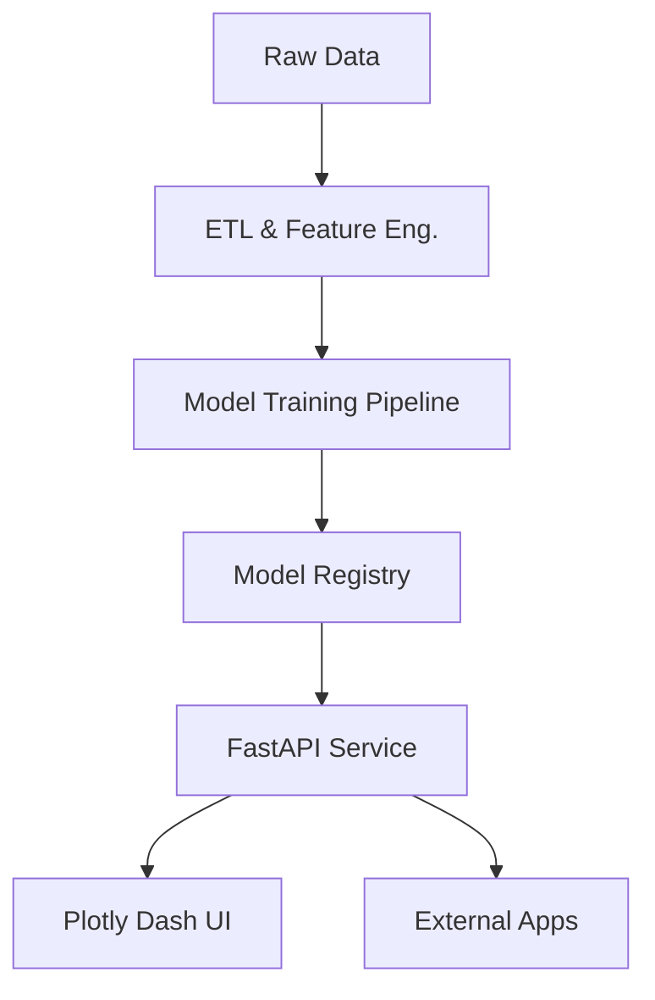

# Predictive Analytics Platform


## 👨‍💻 About The Project

Hi there! I built this platform to bridge the gap between raw customer data and actionable business insights. In the real world, data doesn't just sit there; it tells a story. My goal was to build a system that listens to that story and predicts the next chapter.

This isn't just a collection of scripts; it's a **production-grade architecture** demonstrating how ML models can be deployed as microservices, complete with real-time APIs, interactive dashboards, and automated pipelines.

## 🧠 The Intelligence Core

I implemented three distinct machine learning approaches to tackle different aspects of customer behavior:

1.  **Customer Lifetime Value (CLV) Forecasting**
    *   *Technique:* **Gradient Boosting (XGBoost)**
    *   *Why?* CLV data is often non-linear and zero-inflated. XGBoost handles these irregularities beautifully while offering high predictive power.
    *   *Outcome:* Predicts exactly how much value a customer brings over their lifespan.

2.  **Churn Risk Detection**
    *   *Technique:* **Random Forest Classifier**
    *   *Why?* I needed a robust model that resists overfitting and provides interpretable feature importance (so we know *why* someone is leaving).
    *   *Outcome:* Flags at-risk customers before they leave, enabling proactive retention.

3.  **Behavioral Segmentation**
    *   *Technique:* **K-Means Clustering**
    *   *Why?* Unsupervised learning allows us to discover natural groupings in the data without bias.
    *   *Outcome:* Identifies 5 distinct personas (e.g., "Loyal Regulars", "High-Value Engaged") for targeted marketing.

## 🏗️ System Architecture

I designed this as a modular system to mimic a real-world microservices environment:



*   **Data Layer**: Synthetic data generator that mimics real-world distributions (Pareto principles in spending, etc.).
*   **ML Layer**: Scikit-learn & XGBoost pipelines with automated feature engineering.
*   **Serving Layer**: FastAPI for high-performance, asynchronous inference.
*   **Presentation Layer**: Plotly Dash for interactive, business-intelligence grade visualizations.

## 🚀 Quick Start

### 1. Setup
```bash
# Clone the repo
git clone https://github.com/probablynotnmp/predictive-analytics-platform.git
cd predictive-analytics-platform

# Install dependencies
pip install -r requirements.txt
```

### 2. Training
Run the training pipeline to generate data and train the models from scratch:
```bash
python src/models/model_trainer.py
```
*You'll see the training logs as it engineers features and optimizes the models.*

### 3. Launch the Platform
Fire up the API and Dashboard:
```bash
# Terminal 1: API
uvicorn src.api.main:app --reload --port 8000

# Terminal 2: Dashboard
python src/visualization/dashboard.py
```

Visit the **Dashboard** at `http://localhost:8050`, and Done!

## 📊 API Documentation

I believe good code documents itself. The API comes with full UI documentation.
Once running, visit: `http://localhost:8000/docs`

**Sample Prediction Request:**
```json
POST /predict/comprehensive
{
  "age": 28,
  "account_type": "Premium",
  "tenure_days": 450,
  "recency": 5,
  "frequency": 4.2,
  "monetary": 1200.0,
  "email_open_rate": 85.5,
  ...
}
```

## 🛠️ Tech Stack & Design Choices

*   **Python 3.10**: For modern type hinting and performance.
*   **FastAPI**: Chosen over Flask for its native async support and automatic Pydantic validation.
*   **Plotly Dash**: Preferred over Tableau for this project to keep the entire stack Python-native and version-controllable.
*   **Docker**: Containerized for "works on my machine" guarantees.

## 📈 Future Improvements

If I were to take this to production, I would:
1.  Replace the CSV storage with **PostgreSQL** or **Snowflake**.
2.  Implement **MLflow** for experiment tracking.
3.  Add **Redis** caching for the prediction endpoints to reduce latency.
